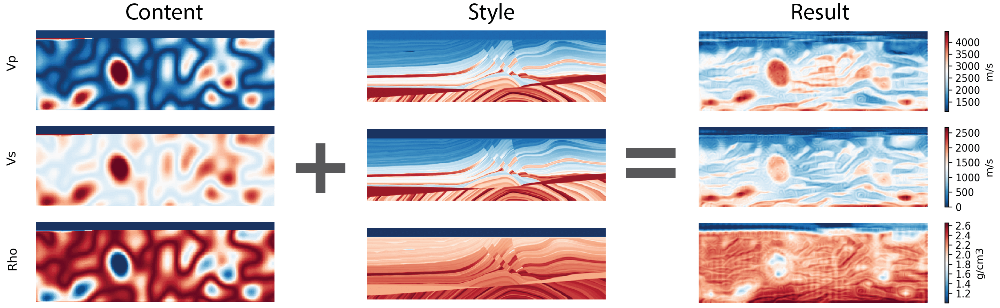
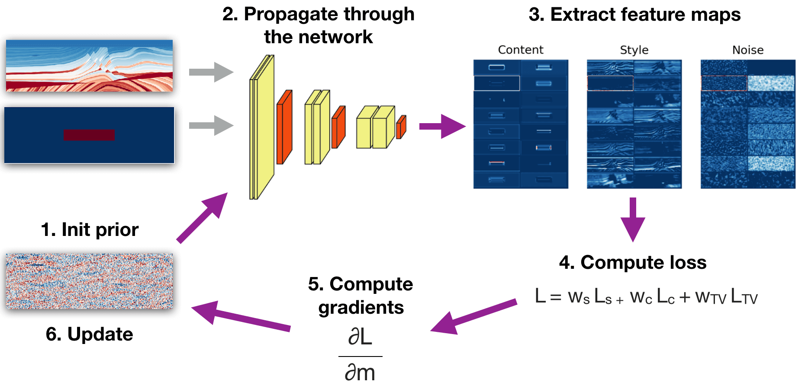
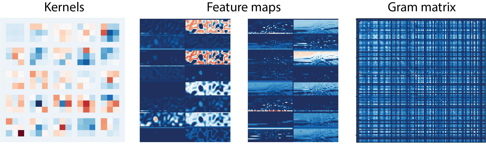
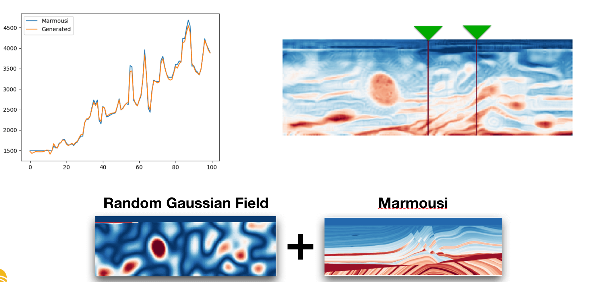

# Style transfer for generation of realistically textured subsurface models. Visualized and explained. 

*Ovcharenko, Oleg, Vladimir Kazei, Daniel Peter, and Tariq Alkhalifah. "Style transfer for generation of realistically textured subsurface models." In SEG Technical Program Expanded Abstracts 2019, pp. 2393-2397. Society of Exploration Geophysicists, 2019.*

The notebook in this repository reproduces the workflow for **texture-transfer from an elastic isotropic subsurface model to a prior synthetic distribution**. We follow the [(Gatys et al., 2015)](https://arxiv.org/abs/1508.06576) to transfer texture from a [Marmousi II](https://library.seg.org/doi/full/10.1190/1.2172306) benchmark geological model to a background distribution generated using a random Gaussian field.

## Example

Make a random gaussian field resamble the Marmousi II layered features.

## Workfolw
We apply the iterative optimization approach which benefits from higher control at cost of longer generation times. To accelerate the texture transfer one would use a GAN-based approach as proposed by [(Johnson et al., 2016)](https://link.springer.com/chapter/10.1007/978-3-319-46475-6_43) and [(Ulyanov et al., 2016)](http://proceedings.mlr.press/v48/ulyanov16.pdf).

## Visualizations
Seeing the outputs from intermediate layers in the network leads to better understaing of what is going on at each step of the algorithm.

## Well-log constrains 
Enforcing the optimization to match certain areas from the style model ultimately leads to a controlled texture generation.

Resources used:

https://github.com/kevinzakka/style-transfer

https://www.tensorflow.org/beta/tutorials/generative/style_transfer
